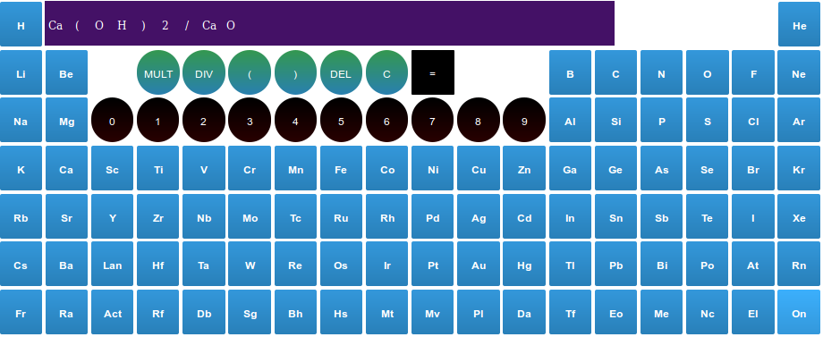

# calculadora-molecular 
Aplicación móvil desarrollada en Apache cordova, se trata de una calculadora que determina el peso molecular
de compuestos a partir de su formula química, y realiza operaciones con estos resultados. Ejemplo:

Ca(OH)2 / CaO = Factor

Esta operación divide el peso molecular del Hidróxido de Calcio, entre el peso molecular del Oxido de Calcio, esto es útil cuando
se necesita realizar una determinación indirecta, en este caso si hemos encontrado el contenido de Oxido de Calcio 
y queremos determinar indirectamente el contenido de Hidróxido de Calcio, tendremos que multiplicar el porcentaje de
oxido de calcio obtenido, por el "Factor" calculado.

